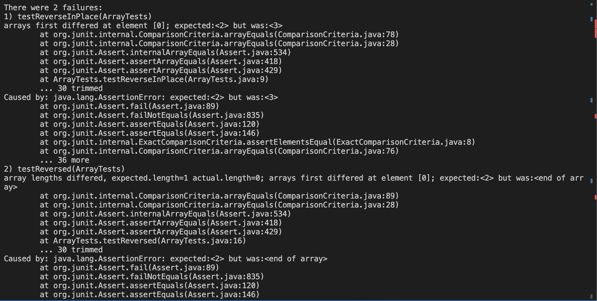
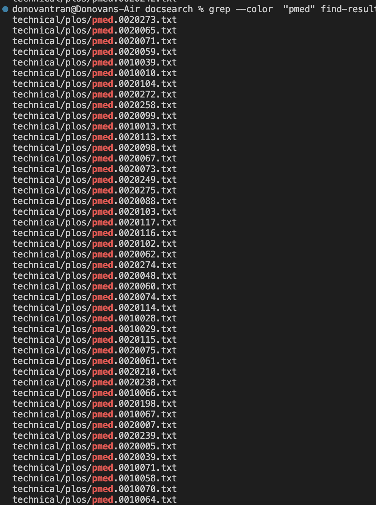
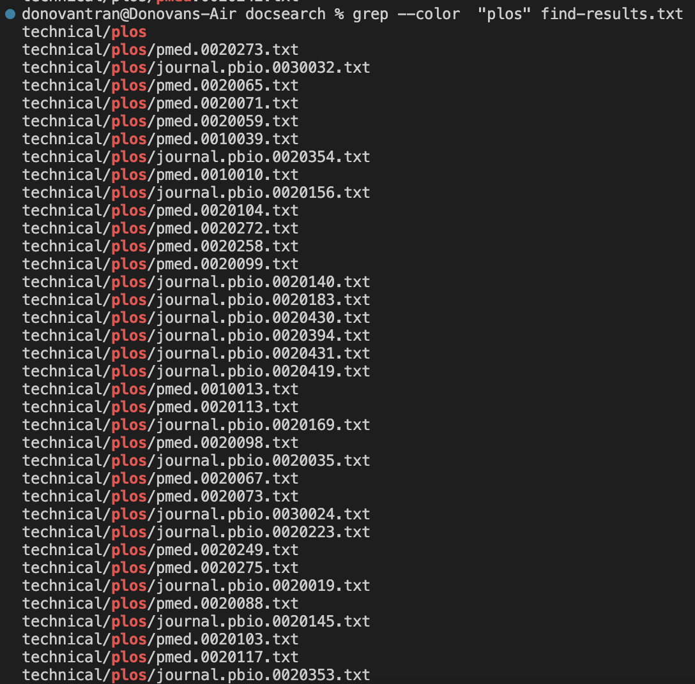
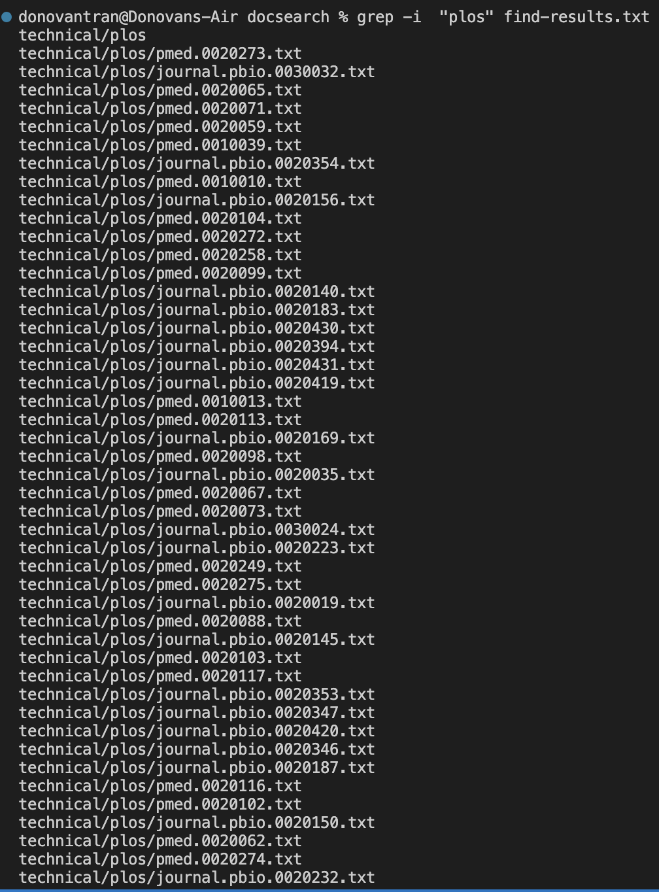
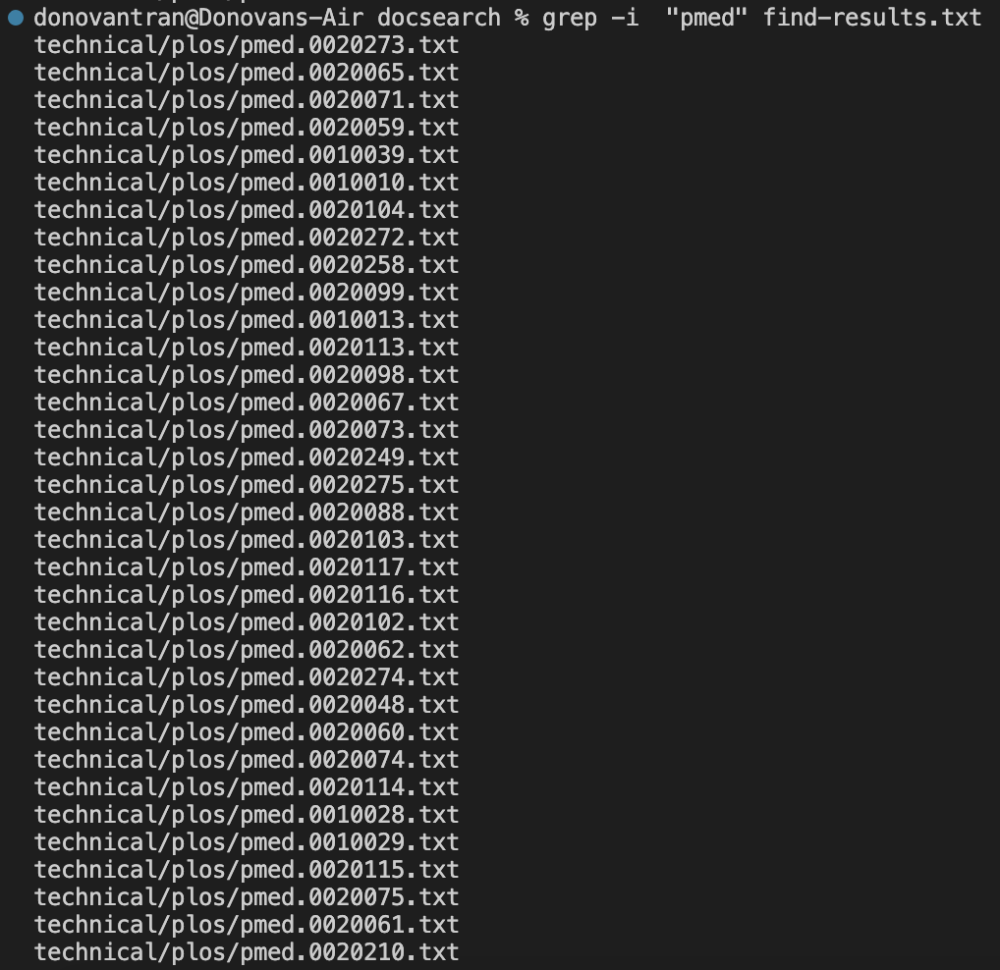
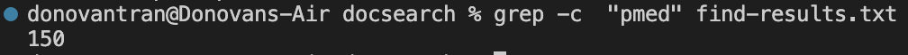
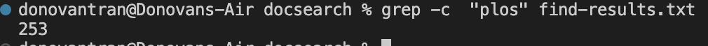
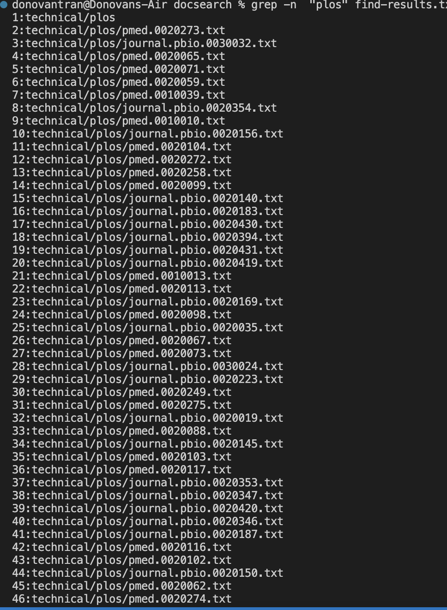
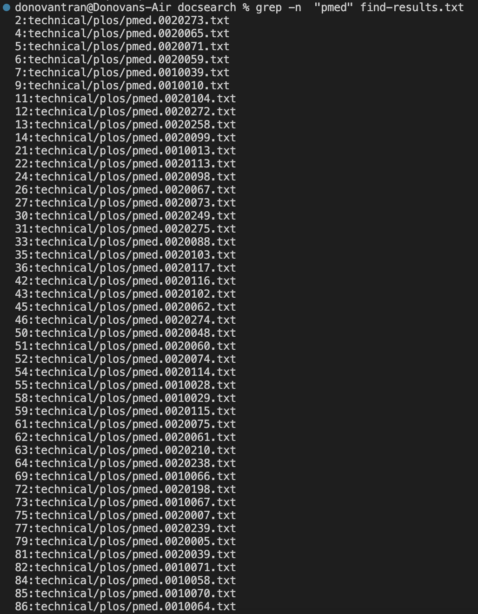

# Lab Report 3
---

## Part 1
The bug I chose was the one from Array Examples, which had bugs in not only the actual code but also the JUnit Test. The follow is code for the buggy ArrayExampelsas and ArrayTest.

```
public class ArrayExamples {

  // Changes the input array to be in reversed order
  static void reverseInPlace(int[] arr) {
    for(int i = 0; i < arr.length; i += 1) {
      arr[i] = arr[arr.length - i - 1];
    }
  }

  // Returns a *new* array with all the elements of the input array in reversed
  // order
  static int[] reversed(int[] arr) {
    int[] newArray = new int[arr.length];
    for(int i = 0; i < arr.length; i += 1) {
      arr[i] = newArray[arr.length - i - 1];
    }
    return arr;
  }

  // Averages the numbers in the array (takes the mean), but leaves out the
  // lowest number when calculating. Returns 0 if there are no elements or just
  // 1 element in the array
  static double averageWithoutLowest(double[] arr) {
    if(arr.length < 2) { return 0.0; }
    double lowest = arr[0];
    for(double num: arr) {
      if(num < lowest) { lowest = num; }
    }
    double sum = 0;
    for(double num: arr) {
      if(num != lowest) { sum += num; }
    }
    return sum / (arr.length - 1);
  }
}

```

```
import static org.junit.Assert.*;
import org.junit.*;

public class ArrayTests {
	@Test 
	public void testReverseInPlace() {
    int[] input1 = { 3 };
    ArrayExamples.reverseInPlace(input1);
    assertArrayEquals(new int[]{ 3 }, input1);
	}

  @Test
  public void testReverseInPlace1(){
    int[] input1 = {5,4,3,2,1};
    ArrayExamples.reverseInPlace(input1);
    assertArrayEquals(new int[]{1,2,3,4,5},input1);
  }


  @Test
  public void testReversed() {
    int[] input1 = { };
    assertArrayEquals(new int[]{ }, ArrayExamples.reversed(input1));
  }
}
```
These two Java files have problems in their code. Firstly, there is a problem with the `reversed` method not returning the correct `int[]` array. Secondly, there is also a flaw a with the reverseInPlace method as well.

A failure-inducing input could be: 
```
int[] input = {6,4,2,0};
```
This is a failure inducing input beacause it gives out the wrong output and expected output.

A input that doesn't provide a failure-inducing input could be:
```
int[] input = {9};
```
These are the failed input screenshots:


The before code was shown above, this is the after code(when getting rid of all the bugs):
```
public class ArrayExamples {

  // Changes the input array to be in reversed order
  static void reverseInPlace(int[] arr) {
    for(int i = 0; i < arr.length/2; i++) {
      int holder;
      holder = arr[i];
      arr[i] = arr[arr.length - i -1];
      arr[arr.length - i - 1] = holder;
    }
  }

  // Returns a *new* array with all the elements of the input array in reversed
  // order
  static int[] reversed(int[] arr) {
    int[] newArray = new int[arr.length];
    for(int i = 0; i < arr.length; i += 1) {
      newArray[i] = arr[arr.length - i - 1];
    }
    return newArray;
  }

  // Averages the numbers in the array (takes the mean), but leaves out the
  // lowest number when calculating. Returns 0 if there are no elements or just
  // 1 element in the array
  static double averageWithoutLowest(double[] arr) {
    if(arr.length < 2) { return 0.0; }
    double lowest = arr[0];
    for(double num: arr) {
      if(num < lowest) { lowest = num; }
    }
    double sum = 0;
    for(double num: arr) {
      if(num != lowest) { sum += num; }
    }
    return sum / (arr.length - 1);
  }


}
```

```
import static org.junit.Assert.*;
import org.junit.*;

public class ArrayTests {
	@Test 
	public void testReverseInPlace() {
    int[] input1 = { 3 };
    ArrayExamples.reverseInPlace(input1);
    assertArrayEquals(new int[]{ 3 }, input1);
	}

  @Test
  public void testReverseInPlace1(){
    int[] input1 = {5,4,3,2,1};
    ArrayExamples.reverseInPlace(input1);
    assertArrayEquals(new int[]{1,2,3,4,5},input1);
  }


  @Test
  public void testReversed() {
    int[] input1 = { };
    assertArrayEquals(new int[]{ }, ArrayExamples.reversed(input1));
  }

  @Test
public void testReversed1(){
  int[] input1 = {1,2,3,4};
  assertArrayEquals(new int[]{4,3,2,1}, ArrayExamples.reversed(input1));
}
}
```

## Part 2
---
The command that I am researching is the `grep` command. This command allows you to print out what is in a particular text file. In my case we use input direction to put the text files in `./technical` into a txt file called `find-results.txt`. Here are the options that I am researching.

`--color`


These images show what using the command `$ grep --color "pmed" find-result.txt` and `$ grep --color "plos" find-result.txt` does. They will highlight any of the files that contain the text "pmed" or "plos". This is extremely helpful when trying to highlight words that may be of importance when scanning through a document.

---
`-i`


These image show what using the command `$ grep -i "pmed find-result.txt` and `$ grep -i "plos" find-result.txt` does. In this situation it doesn't do much because it is suppose to search through the text file and output out the inputed string in the command while igorning the case that it was inputed and searched for. This could be extremely helpful when searching text files from different users that may use different case structures.

---
`-c`


The images above shows the output of what using `$ grep -c "pmed" find-result.txt` and `$ grep -c "plos" find-result.txt` gives. This goes through the document and looks for how many lines contain the inputed string and counts it up. It will then output the total amount of lines where the string has matched. This is extremely useful when going through a file where you need to quickly count up the amount of lines.

---
`-n`


The last command that I researched was the `-n` command which numbers the lines that contained the search pattern. In this case I used the command `$ grep -n "pmed" find-result.txt` and `$ grep -n "plos" find-result.txt` which numbered the lines in the output in the picutre. This is extremely useful when tying to number out a list with a given pattern.

*This imformation was found on the website: https://www.digitalocean.com/community/tutorials/grep-command-in-linux-unix*


